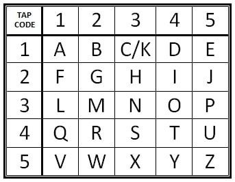
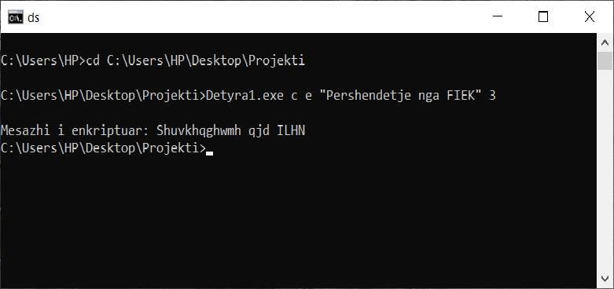
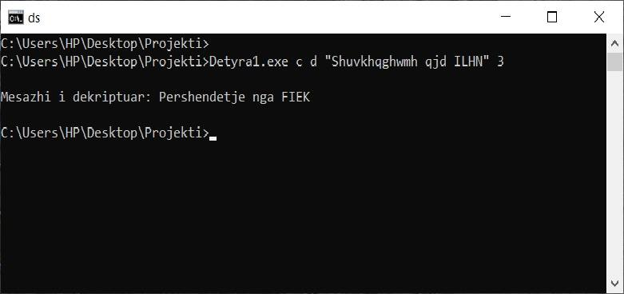
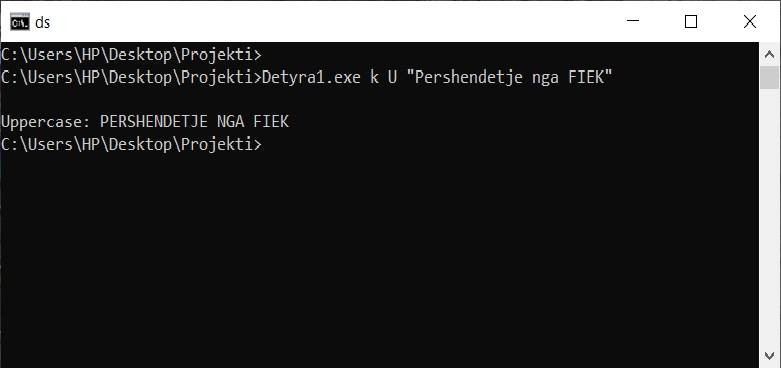
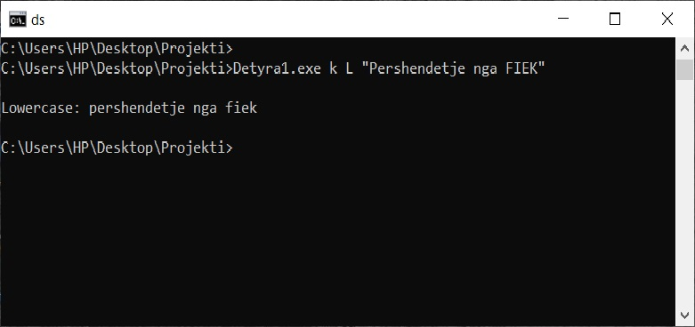
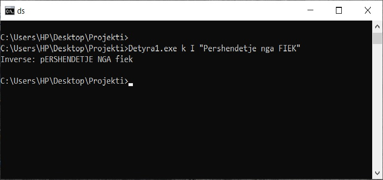
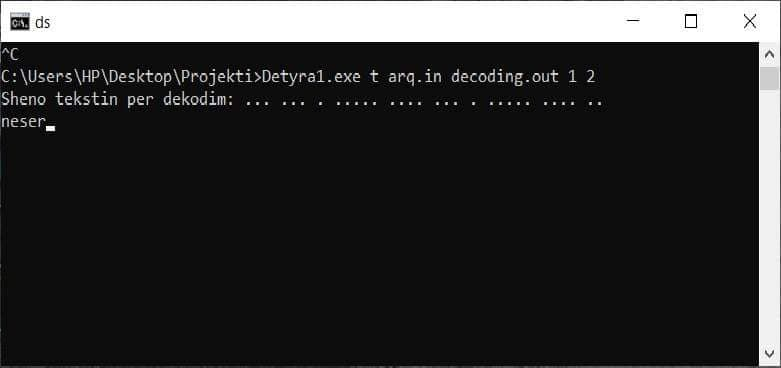

# Tap Code, Komanda Case dhe Komanda Ceasar

# Tap Code

Tap Code, nganjehere i quajtur edhe si Knock Code, eshte nje menyre e dekodimit te mesazheve, shkronje per shkronje, ne nje menyre te thjeshte.
Mesazhi transmetohet me ane te "tap sounds", prej nga e ka marre edhe emrin. Tap Code eshte perdorur nga te burgosurit ne Vietnam, per komunikim me njeri tjetrin. Tap Code eshte i bazuar ne Polybius Square, duke perdorur nje tabele 5x5, tabele e cila ka ne vete te gjitha shkronjat e alfabetit latin, pervec shkronjes K e cila perfaqesohet nga shkronja C.
 
 

# Ceasar Cipher

Ne kryptografi, Ceasar Cipher, eshte nje nga teknikat me te thjeshta dhe shume te njohura te enkriptimit. Eshte nje lloj i  substitution cipher, ku cdo shkronje zevendosohet me nje shkronje tjeter, duke u bazuar ne celesin qe i jepim. Psh: nese vendosim celesin 3 nga e majta, atehere shkronja D do te zevendesohej me shkronjen A.

 
 
 
 # Komanda Case
 
 Komanda Case ka perfshire komandat uppercase(ku kthen shkronjat ne te gjitha te medha), lowercase(kthen shkronjat ne te gjitha te vogla), inverse(te kunderten per cdo shkronje) dhe capitalize(cdo shkronje te pare te cdo fjale e kthen ne shkronje te madhe).
 Me poshte jepen edhe shembujt e ekzekutimit te ketyre nenkomandave.
 #
 #
 *Ekzekutimi i programit behet ne command prompt, permes dhenies se argumenteve. Nese argumenti i pare eshte 't', atehere kemi te bejme me Tap Code, nese 'c' kemi te bejme me Ceasar Cipher dhe nese 'k' kemi te bejme me komanden Case.Ne raste tjera programi do te paraqes nje tekst qe dhenia e argumenteve eshte gabim. Ne rastin e Tap Code, argumenti i dyte dhe i trete jepen si fajlla dhe nese argumentet tjera jane 1 1, perdoruesi duhet te shenoj tekstin per t'a enkoduar, nese 1 2 vlen e kunderta. Ne rastin e Ceasar Cipher, argumenti i dyte 'e' nenkupton enkriptim, ndersa 'd' nenkupton dekriptim. Pastaj japim tekstin dhe celesin perkates. Sa i perket komandes Case, argumenti i dyte percakton nenkomanden perkatese, ku:
 'U' - Uppercase,
 'L' - Lowercase,
 'I' - Inverse dhe
 'C' - Capitalize
 dhe pastaj shkruajme tekstin perkates.
 #
 #
 Kodi referues per komanden Tap Code eshte: https://github.com/ReinaldoDiasAbreu/tapcode, me disa modifikime!
 
 Kodi referues per komanden Ceasar Ciper eshte: https://github.com/VoxelPixel/CiphersInCplusplus
 #
Shembuj te ekzekutimit te seciles komande dhe nenkomande:

   Enkriptimi:

   Dekriptimi:

   Uppercase:

   Lowercase:

   Inverse:

   Capitalize:

 
Enkodimi:

Dekodimi:

 
